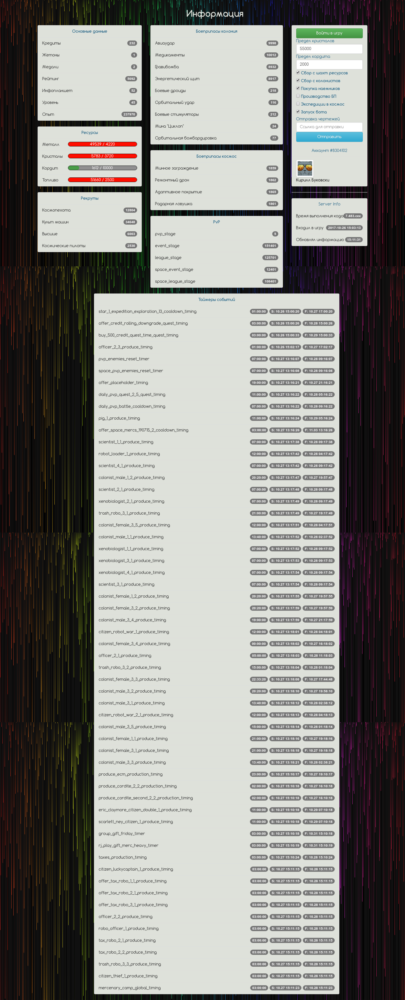

# Peklo-Bot-Parser

Бот для онлайн игры Пекло.
Работатет на Ubuntu c Apache

- Заходим в parser.php

$uidCreateNew = 00000; 
> Тут ваш ID от страницы VK 9304105

$auth_keyCreateNew = '00aa000aaa000aaa'; 
> Тут ваш ключ sk_auth_key от игры в виде строки '50cb122688ca8ee1eccc28437e762e72'

- Где взять этот ключ?
Ваш auth_key посмотреть его можно зайдя в игру, кликаем на игровом поле, открываем консоль нажатием Ctrl+Shift+Enter, в окне вводим: params_print Находим строчку sk_auth_key: - это и есть Ваш уникальный auth_key. вводим params_print (именно маленькими буквами)

- Настройка БД mysql
необходимо создать БД 
'peklo' 
и запустить парсер из браузера через startWrap.php он сгенерирует нужную таблицу

- Настрока Крона для запуска парсера (бота) каждые 5 минут

sudo gedit /etc/crontab  
> Откроет в редакторе настроки для крона

*/5 * * * * alessa /usr/bin/wget -t 1 -O - 'http://testsite.dev/phpQuery-parser/pekloBotGit/startWrap.php'; 
> Указываете свой адрес по которому на вашем сетвере запускается парсер(бот)

service cron restart 
> Перезапускаем крон

	

